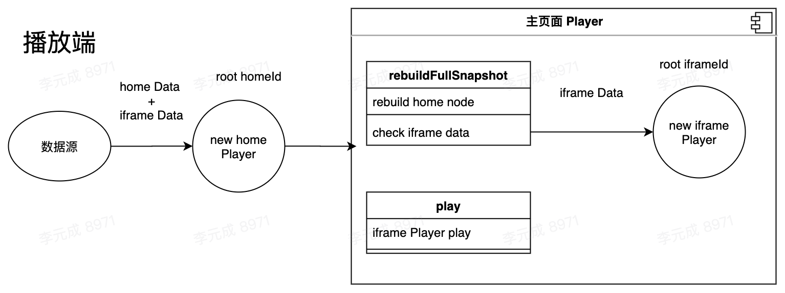

# rrweb-iframe

rrweb 兼容 iframe 录制

vue-demo1 主页面

vue-demo2 iframe 页面 port:3333

# 背景

rrweb 录制含有 iframe 元素内容时，在回放时该区域显示空白。

**原因：** iframe 是一个隔离的箱体，外层没有办法参与录制。

**解决思路：** 针对 iframe 内部也进行 rrweb 采集。

## 解决方案

主页面以及 iframe 页面都进行 rrweb 采集，当主页面触发开始(暂停)录制事件时，也通知 iframe 页面进行开始(暂停)录制。

<div align=center>
  
</div>

### iframe 通信方式

主页面通知 iframe 开始录制

```js
// 第一个参数事件名，第二个参数域名
Iframe.contentWindow.postMessage('rrwebStart', '*')
```

iframe 接收数据

```js
window.addEventListener('message', function (event) {
  if (event.data === 'rrwebStart') {
    rrwebStart() // 执行采集
  }
  if (event.data === 'rrwebEnd') {
    rrwebEnd()
  }
})
```

当我们结束录制时，此时 rrweb 采集的是两份数据(主页面+iframe 页面)。

### 如何针对两份采集数据统一播放

构思了三个思路

1. **合并采集数据。** 拿到主页面数据，将 iframe 节点信息，并入主页面的数据结构里。合并增量快照。

   两份数据起点不同，快照合并，id 匹配，不太现实。

2. **dom 拷贝或移动。** 把 iframe 播放端相关的 iframe 元素内容替换到主页面的 iframe 区域。

   iframe 移动时，会造成重载 src 效果，因为 rrweb 处理后的 iframe 是不含 src 的，移动后会造成内容清空。

3. **定位播放器。** 将 iframe 采集的播放端覆盖在主页面的播放端上层。

   存在的问题：播放元素大小匹配问题。页面滚动时，上层播放器需跟随滚动问题。两个播放器需同时播放。
   解决方案：播放上层内容时，获取到原始 iframe 的 宽高以及 offset 信息，然后监听滚动事件，对定位的播放器重置大小。

   ```js
   setIframeRect(replayContent) {
     const iframeRect = replayContent.getElementById('authIframe').getBoundingClientRect();
     console.log(iframeRect);

     document.getElementById('replayIframe').style.top = `${iframeRect.top}px`;
     document.getElementById('replayIframe').style.left = `${iframeRect.left}px`;
     // document.getElementById('replayIframe').style.width = `${iframeRect.width}px`;
     // document.getElementById('replayIframe').style.height = `${iframeRect.height}px`;
   },
   ```

4. **修改源码** 在初始化 homeEvents 数据，rebuild 全量快照时，这时候初始化 iframeEvents 到对应的 iframe 标签上。

<div align=center>
  
</div>

#### 修改源码方案核心代码

```ts
// 业务方初始化数据
this.homeReplayer = new this.Replayer(homeEvents, {
  root: document.getElementById('replaycontent'),
  // 新增iframe数据配置
  iframesPlayer: [
    {
      iframeId: 'authIframe',
      iframeEvents: iframeEvents
    },
    {
      iframeId: 'authIframe2',
      iframeEvents: iframeEvents2
    }
  ],
  UNSAFE_replayCanvas: true
})
```

源码需修改的位置如下

```js

const defaultConfig: playerConfig = {
  speed: 1,
  maxSpeed: 360,
  root: document.body,
  ...
  // 新增iframe数据配置
  iframesPlayer: [],
}
```

```js
this.mirror.map = rebuild(event.data.node, {
  doc: this.iframe.contentDocument,
  afterAppend: builtNode => {
    this.collectIframeAndAttachDocument(collected, builtNode)
  },
  cache: this.cache
})[1]

// 在上述代码后添加如下部分代码

const iframesPlayer = this.config.iframesPlayer
if (iframesPlayer.length > 0) {
  for (let i = 0; i < iframesPlayer.length; i++) {
    const { iframeId, iframeEvents } = iframesPlayer[i]
    const doc = this.iframe.contentDocument.getElementById(iframeId).contentDocument.body
    iframesPlayer[i].player = new Replayer(iframeEvents, {
      root: doc,
      insertStyleRules: ['* { color: red }'],
      UNSAFE_replayCanvas: true
    })

    doc.getElementsByTagName('canvas')[0].style.position = 'absolute'
    doc.getElementsByTagName('iframe')[0].style.border = 0
  }
}
```

当触发 homePlayer 播放事件时，同步触发上面创建的 iframe 播放器事件。

```js
public play(timeOffset = 0) {
    if (this.service.state.matches('paused')) {
      this.service.send({ type: 'PLAY', payload: { timeOffset } });
      // 新增下面代码
      setTimeout(() => {
        const iframesPlayer = this.config.iframesPlayer;
        if (iframesPlayer.length > 0) {
          for (let i = 0; i < iframesPlayer.length; i++) {
            const { player } = iframesPlayer[i];
            player.play();
          }
        }
      }, 50);

    } else {
      this.service.send({ type: 'PAUSE' });
      this.service.send({ type: 'PLAY', payload: { timeOffset } });
    }
  }
```
